# 📊 Diagramas de Flujo del Proyecto — Edu-Verse

Este documento contiene la representación visual y los diagramas de flujo completos de **Edu-Verse** en formato de **imágenes PNG** y sus correspondientes especificaciones en **Mermaid**, abarcando la arquitectura de infraestructura, flujos de autenticación, módulo de apuntes, comunidad, colaboración en tiempo real con WebSockets (Socket.IO), panel de administración y el modelo entidad-relación de la base de datos PostgreSQL.

---

## 📋 Índice de Diagramas

1. [Arquitectura General e Infraestructura](#1-arquitectura-general-e-infraestructura)
2. [Flujo de Autenticación y Autorización (JWT)](#2-flujo-de-autenticacion-y-autorizacion-jwt)
   - [2.1 Registro de Usuario (`POST /auth/signup`)](#21-registro-de-usuario-post-authsignup)
   - [2.2 Inicio de Sesión (`POST /auth/login`)](#22-inicio-de-sesion-post-authlogin)
3. [Flujo de Gestión de Apuntes (Subida y Búsqueda)](#3-flujo-de-gestion-de-apuntes)
4. [Flujo de Comunidad (Favoritos, Comentarios y Valoraciones)](#4-flujo-de-comunidad)
5. [Flujo de Equipos y Colaboración en Tiempo Real (Socket.IO)](#5-flujo-de-equipos-y-colaboracion-en-tiempo-real)
6. [Flujo de Administración y Moderación de Usuarios](#6-flujo-de-administracion-y-moderacion)
7. [Modelo Entidad-Relación (Base de Datos)](#7-modelo-entidad-relacion-base-de-datos)

---

## 1. Arquitectura General e Infraestructura

Representación de la arquitectura multinivel desplegada con **Docker Compose**.

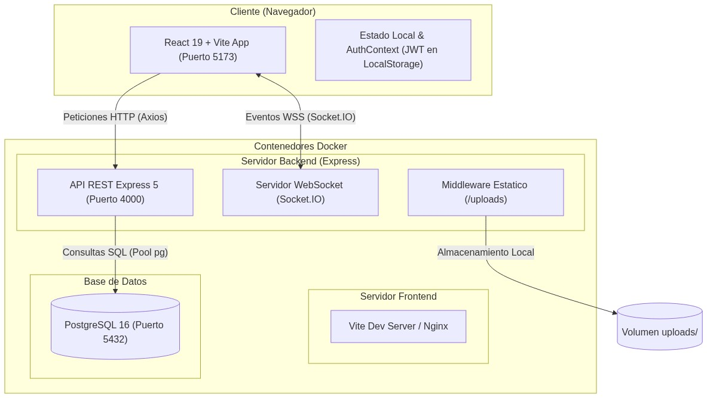

🔍 Ver código del diagrama (Mermaid)

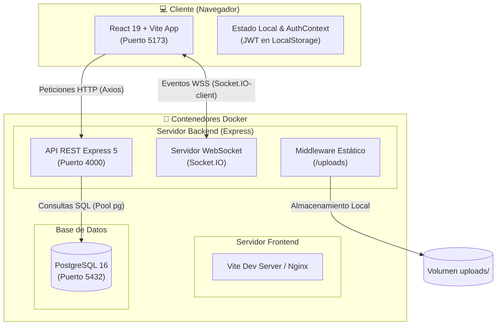

---

## 2. Flujo de Autenticación y Autorización (JWT)

### 2.1 Registro de Usuario (`POST /auth/signup`)

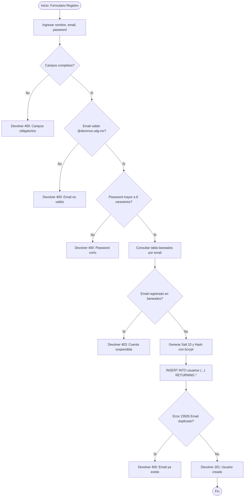

🔍 Ver código del diagrama (Mermaid)

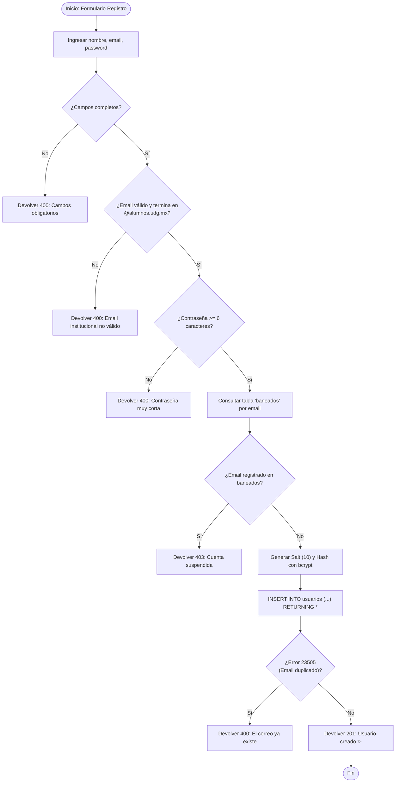

### 2.2 Inicio de Sesión (`POST /auth/login`)

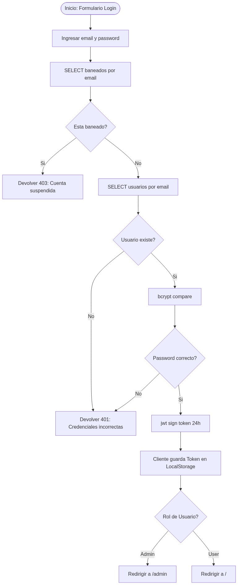

🔍 Ver código del diagrama (Mermaid)

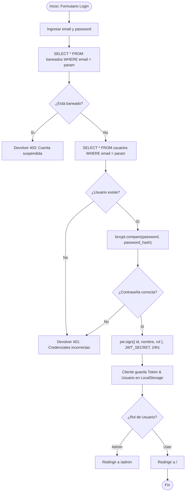

---

## 3. Flujo de Gestión de Apuntes

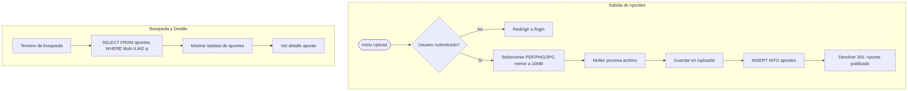

🔍 Ver código del diagrama (Mermaid)

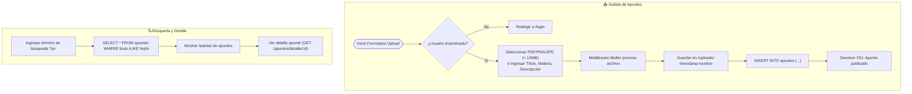

---

## 4. Flujo de Comunidad

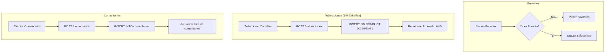

🔍 Ver código del diagrama (Mermaid)

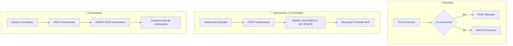

---

## 5. Flujo de Equipos y Colaboración en Tiempo Real

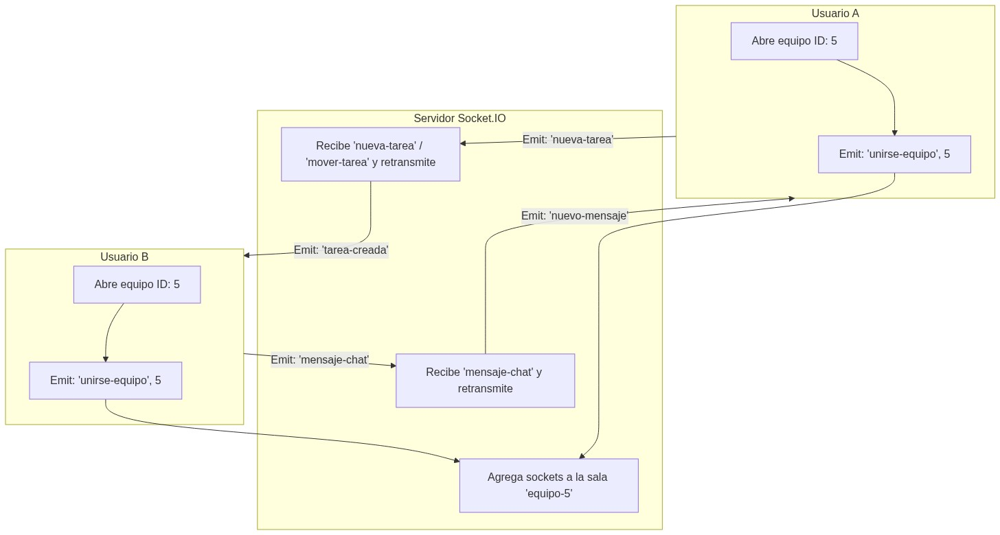

🔍 Ver código del diagrama (Mermaid)

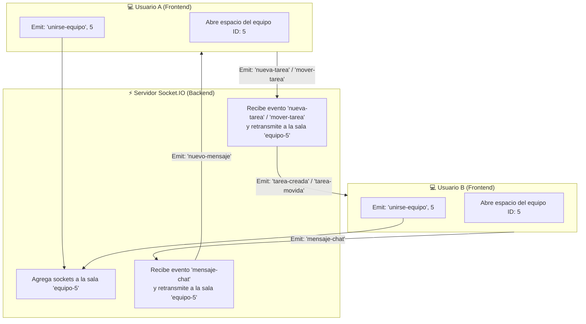

---

## 6. Flujo de Administración y Moderación

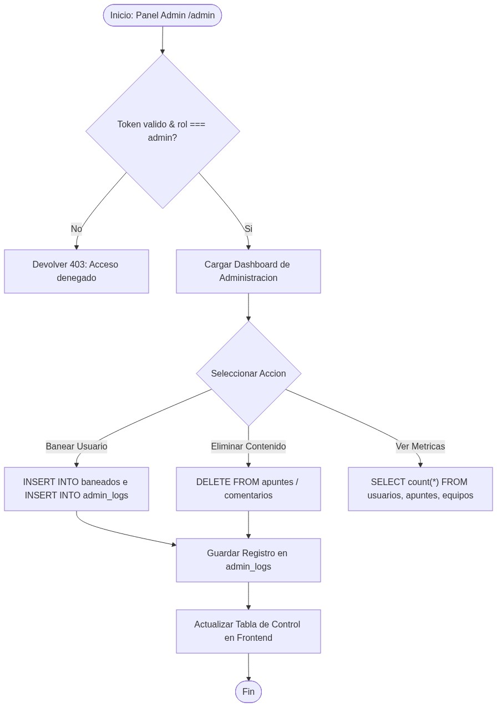

🔍 Ver código del diagrama (Mermaid)

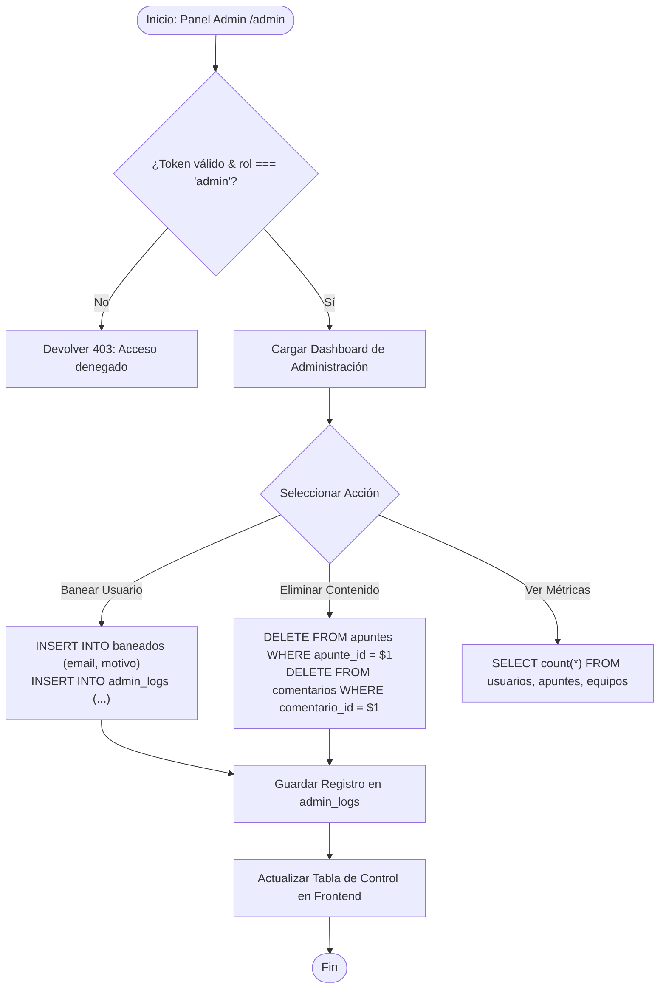

---

## 7. Modelo Entidad-Relación (Base de Datos)

Diagrama de la estructura de tablas de **PostgreSQL** (`Edu-verseDB`).

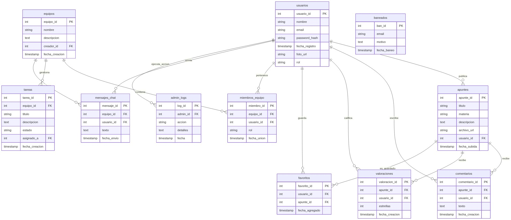

🔍 Ver código del diagrama (Mermaid)

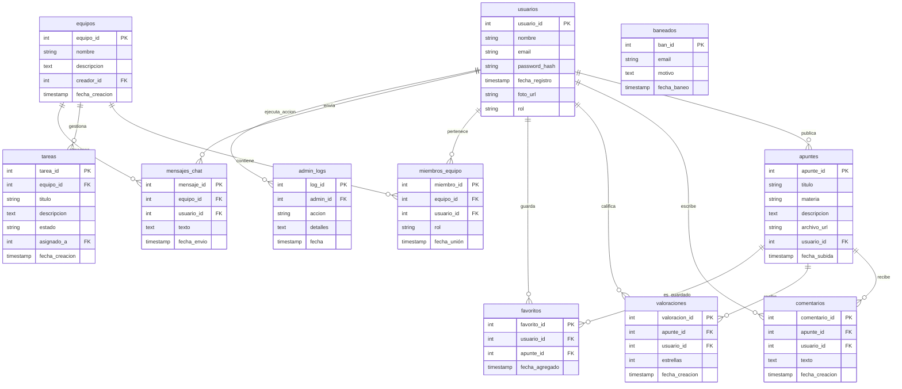

---

*Documentación oficial del proyecto Edu-Verse.*
