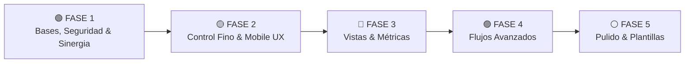
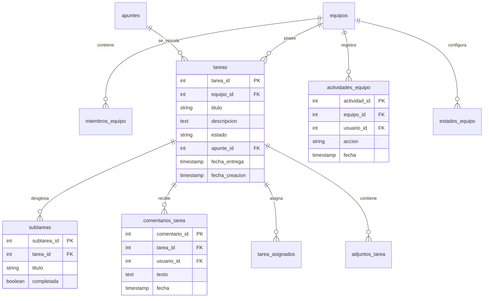

# 🚀 Plan de Mejora v2 — Módulo de Gestor de Equipos

**Fecha:** 24 de septiembre de 2026  
**Módulo:** `GestorEquipos.jsx` (`edu-verse/src/pages/GestorEquipos.jsx`)  
**Referencia de mercado:** ClickUp / Trello (adaptado al contexto académico de Edu-Verse)

---

## 1. Resumen Ejecutivo y Diagnóstico del Estado Actual

Actualmente, el módulo `GestorEquipos.jsx` cuenta con una base sólida de colaboración en tiempo real apoyada en **Socket.IO**, gestión de tareas Kanban y chat por equipo.

### 📊 Estado Actual de Funcionalidades

| Capacidad | Estado Actual |
|-----------|---------------|
| **Equipos** | Creación y unión mediante código de 6 caracteres. |
| **Membresía** | Roles almacenados (`admin` / `miembro`), lista de integrantes en sidebar. |
| **Tablero Kanban** | 3 estados fijos: `pendiente`, `en_progreso`, `completada` con Drag & Drop. |
| **Prioridades** | `verde` (no urgente), `amarillo` (urgente), `rojo` (pocos días) con auto-asignación por fecha. |
| **Asignación** | Un solo usuario asignado por tarea. |
| **Chat** | Tiempo real por equipo con Socket.IO y contador de mensajes no leídos. |
| **Sincronización** | Emisión de eventos WebSockets para crear, mover, editar y eliminar tareas. |

### ⚠️ Limitaciones Diagnosticadas (Oportunidades de Mejora)
1. **Seguridad Incompleta:** Los permisos del rol `admin` no se validan en backend (cualquier miembro puede borrar tareas o alterar el equipo).
2. **Sin Desglose de Tareas:** Falta de subtareas o checklists para dividir proyectos complejos.
3. **Comunicación Aislada:** Discusiones mezcladas en el chat general en lugar de comentarios por tarea.
4. **Vista Móvil Rígida:** Desplazamiento horizontal incómodo en tableros Kanban móviles.
5. **Desconexión con la Biblioteca:** Falta de sinergia entre el gestor de equipos y la biblioteca de apuntes de Edu-Verse.

---

## 2. Criterios de Priorización

El plan v2 se reorganiza bajo 4 pilares estratégicos:

1. **Seguridad e Integridad del Sistema:** Proteger los datos del equipo restringiendo acciones críticas según el rol.
2. **Valor Estudiantil Inmediato:** Resolver la necesidad real de dividir trabajos grupales universitarios.
3. **Sinergia con Edu-Verse:** Vincular el módulo de equipos con la biblioteca de apuntes académica.
4. **Eficiencia Técnica:** Aprovechar la infraestructura existente (Socket.IO, Multer, PostgreSQL) sin introducir complejidad innecesaria.

---

## 3. Fases de Implementación Reorganizadas

---

### 🟢 FASE 1 — Bases de Colaboración, Seguridad y Sinergia (Prioridad Máxima)

#### 1.1 Validación Real de Roles (`admin` vs `miembro`)
- **Qué:** Restringir acciones críticas (eliminar tareas, gestionar miembros, cambiar estados) exclusivamente a usuarios con rol `admin` del equipo.
- **Por qué:** Evita borrados accidentales o sabotaje entre integrantes.
- **Cómo:** Middleware en backend que valida `miembros_equipo.rol === 'admin'` antes de ejecutar mutaciones.

#### 1.2 Subtareas y Checklists en Tarjetas
- **Qué:** Dividir una tarea en items o subtareas comprobables con barra de progreso visual (`2/5 completadas`).
- **Por qué:** Los estudiantes necesitan desglosar entregables en partes ("Introducción", "Diagramas", "Conclusión").
- **Cómo:** Nueva tabla `subtareas (subtarea_id, tarea_id, titulo, completada, creado_por)` con `ON DELETE CASCADE`.

#### 1.3 Comentarios por Tarea
- **Qué:** Hilo de discusión dedicado dentro del modal de cada tarea.
- **Por qué:** Mantiene las dudas y precisiones técnicas en el contexto de la tarea sin saturar el chat general.
- **Cómo:** Tabla `comentarios_tarea`, endpoints `POST /tareas/:id/comentarios` y retransmisión por Socket.IO (`comentario-nuevo`).

#### 1.4 Búsqueda y Filtros en el Tablero (Client-side)
- **Qué:** Filtrar tarjetas en tiempo real por palabra clave, integrante asignado o nivel de prioridad.
- **Por qué:** Permite encontrar información al instante en tableros con muchas tareas.
- **Cómo:** Implementación en React mediante `useMemo` filtrando sobre el estado local de `tareas`.

#### 1.5 Enlace con la Biblioteca de Apuntes Edu-Verse
- **Qué:** Permitir adjuntar o enlazar un apunte público de la biblioteca a una tarea del equipo.
- **Por qué:** Aprovecha el valor único de Edu-Verse integrando el material de estudio con el trabajo colaborativo.
- **Cómo:** Columna opcional `apunte_id` en la tabla `tareas`.

---

### 🟡 FASE 2 — Control Fino, Adjuntos y Responsividad (Prioridad Alta)

#### 2.1 Múltiples Asignados por Tarea
- **Qué:** Asignar una tarea a 2 o más miembros del equipo.
- **Por qué:** En trabajos grupales universitarios las actividades suelen ser realizadas en parejas o triadas.
- **Cómo:** Tabla puente `tarea_asignados (tarea_id, usuario_id)`.

#### 2.2 Adjuntos a Tareas con Cuota por Equipo
- **Qué:** Subir archivos (PDF, PNG, JPG) directamente a una tarea.
- **Por qué:** Permite compartir la evidencia o avances de la entrega.
- **Cómo:** Endpoint `POST /tareas/:id/adjuntos` reutilizando Multer. Límite de **50 MB totales por equipo** para proteger el disco del servidor Docker.

#### 2.3 Historial de Actividad (Audit Feed)
- **Qué:** Feed con el registro de eventos del equipo (quién creó, movió, editó o completó una tarea).
- **Por qué:** Aporta transparencia al trabajo realizado por cada integrante.
- **Cómo:** Tabla `actividades_equipo (actividad_id, equipo_id, usuario_id, accion, fecha)` consultable desde un panel colapsable.

#### 2.4 Etiquetas Personalizadas (Tags)
- **Qué:** Chips de colores etiquetables (`Examen`, `Proyecto Final`, `Práctica`, `Investigación`).
- **Por qué:** Organización y reconocimiento visual inmediato.
- **Cómo:** Tablas `tags` y `tarea_tags`.

#### 2.5 Vista Móvil Optimizada por Pestañas (Tabs UX)
- **Qué:** Alternar en móviles entre columnas Kanban usando pestañas (`Pendiente` | `En Progreso` | `Completada`).
- **Por qué:** Mejora la experiencia en smartphones evitando scroll horizontal incómodo.
- **Cómo:** Componente responsivo en React con Tailwind (`md:hidden`).

---

### 🔵 FASE 3 — Visibilidad, Vistas y Métricas (Prioridad Media)

#### 3.1 Vista de Calendario
- **Qué:** Alternar la vista del equipo entre Kanban y Calendario según `fecha_entrega`.
- **Por qué:** Visualización clara de los plazos de entrega del semestre.
- **Cómo:** Componente de calendario mensual consumiendo los mismos datos de `tareas`.

#### 3.2 Dashboard de Progreso del Equipo
- **Qué:** Tarjetas con métricas visuales (% de tareas completadas, tareas por miembro, distribución de prioridades).
- **Por qué:** Permite al equipo evaluar si van a tiempo con el proyecto.
- **Cómo:** Endpoint `GET /equipos/:id/stats`.

#### 3.3 Notificaciones de Recordatorio (In-App)
- **Qué:** Alertas de tareas próximas a vencer (24 horas antes) y aviso de tareas vencidas.
- **Por qué:** Previene entregas tardías.
- **Cómo:** Verificación en frontend con alertas toast e integradas en una bandeja de notificaciones en la barra superior.

#### 3.4 Estados Personalizables por Equipo
- **Qué:** Permitir al administrador renombrar o agregar nuevas columnas (`Revisión`, `Bloqueada`).
- **Por qué:** Adapta el flujo a la metodología específica de cada materia.
- **Cómo:** Tabla `estados_equipo (equipo_id, nombre, color, orden)`.

---

### 🟣 FASE 4 — Flujos Avanzados (Prioridad Media-Baja)

#### 4.1 Dependencias entre Tareas (Blockers)
- **Qué:** Definir que la Tarea B depende de la Tarea A, impidiendo marcar B como completada hasta que A finalice.
- **Por qué:** Previene desorden en procesos secuenciales.
- **Cómo:** Tabla `dependencias_tarea (tarea_id, depende_de_id)` con comprobación en el backend.

#### 4.2 Límites WIP (Work In Progress) por Columna
- **Qué:** Definir un máximo de tareas permitidas en la columna `en_progreso`.
- **Por qué:** Evita la saturación y promueve la finalización de tareas abiertas.

#### 4.3 Automatizaciones Simples
- **Qué:** Reglas automáticas (ej. "Al mover a Completada, notificar al creador").
- **Cómo:** Disparadores apoyados en los eventos de Socket.IO.

---

### ⚪ FASE 5 — Pulido y Experiencia (Prioridad Baja)

#### 5.1 Plantillas de Equipos y Tareas
- **Qué:** Precargar un equipo con estructuras de tareas predefinidas para materias comunes ("Proyecto Integrador", "Tesis", "Laboratorio").
- **Cómo:** Tabla `plantillas_equipo`.

#### 5.2 Menciones (`@usuario`)
- **Qué:** Notificar a un integrante al mencionarlo en comentarios o en el chat.

#### 5.3 Papelera de Recuperación (Soft Delete)
- **Qué:** Marcar tareas como eliminadas (`deleted_at`) permitiendo restaurarlas antes de 30 días.

---

## 4. Arquitectura Técnica y Base de Datos

---

## 5. Qué Adoptar y Qué Descartar de ClickUp

### ✅ Lo que SÍ se adopta (Alto Valor Académico)
1. **Acciones desde la Tarjeta:** Comentarios, subtareas y adjuntos directamente en el modal de la tarea.
2. **Subtareas con Progreso:** Visualización del porcentaje de avance (`2/5`).
3. **Múltiples Vistas:** Alternar entre Kanban, Calendario y Lista.
4. **Bandeja de Recordatorios:** Alertas sobre fechas límites de entrega.
5. **Enlace Académico:** Integración con la biblioteca de apuntes de Edu-Verse.

### ❌ Lo que NO se adopta (Evitar Sobre-complejidad)
1. **Jerarquías Complejas (Spaces/Folders/Lists):** En Edu-Verse basta la estructura **Equipo ➔ Tareas**.
2. **Integraciones Externas Pesadas (Zapier, Google Drive, Jira):** Aumentan el mantenimiento sin aportar valor clave.
3. **Agentes de IA dentro de las Tarjetas:** Mantener el enfoque en el contenido de los estudiantes.
4. **Matriz Granular de Permisos Empresariales:** Los roles simplificados `admin` y `miembro` son suficientes.

---

## 6. Roadmap Sugerido de Entregas

| Etapa | Fase | Resultado Entregado |
|-------|------|---------------------|
| **Sprint 1** | **Fase 1** | Módulo seguro y colaborativo: Roles validados, subtareas, comentarios por tarea, filtros y enlace a apuntes. |
| **Sprint 2** | **Fase 2** | Trabajo en equipo avanzado: Múltiples asignados, adjuntos con límite de 50MB, historial de actividad y vista móvil por pestañas. |
| **Sprint 3** | **Fase 3** | Vistas y seguimiento: Vista calendario, dashboard de métricas del equipo y notificaciones de vencimiento. |
| **Sprint 4** | **Fases 4 y 5** | Flujos avanzados y pulido: Dependencias, plantillas, papelera y menciones. |

---

*Documento oficial de planificación v2 para el módulo Gestor de Equipos en Edu-Verse.*
